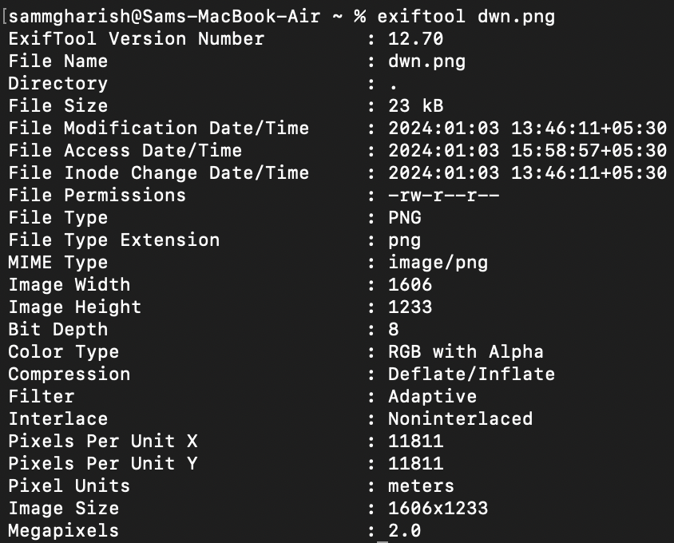
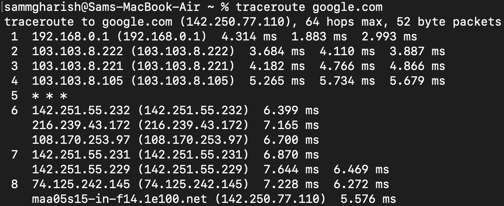
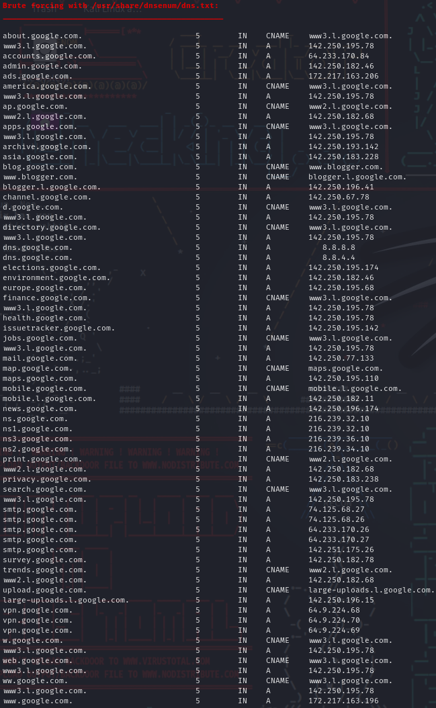
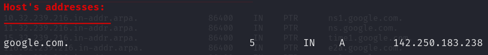

BASH Challenges

1. 
a) To {Display the path of your current directory} Use - '__pwd__'

b) To {List out the contents of your current directory} Use - '__ls__'

c) To {List out the contents of your current directory including hidden files} Use - '__ls -a__'

2. 
a) To Create a new directory named a Use - '__mkdir a__'  
b) To Move to the newly created directory a Use - '__cd a__'  
c) To Create a blank file named “file1” Use - '__vi file1__' & '__:wq__'(save and quit)  
d) To Display the file type of “file1” Use - '__cat file1__'

e) To Add the line “Hello World” to “file1” using the command echo Use - '__echo 'Hello World' > file__'(Replace)
                                                                       - '__echo 'Hello World' >> file__'(Append)
f) To Display the contents of “file1” Use - '__cat file1__'

g) To Display the file type of “file1” again Use - __file file1__

3. 
a) To Stay in directory a. Create a file “file2” and add the contents below using the  command cat Use - '__cat > file2 \n First Line Second Line Third Line <exit using (control+c)>__'

b) To Display the contents of “file2” Use - '__cat file2__'

c) To Display the contents of “file2” with the lines reversed Use - '__cat file2 | rev__'

4. 
a) To Stay in directory a. Concatenate the contents of “file1” and “file2” and save them into a new file “file3” Use - '__cat file1 file2 > file3__'

b) To Display the contents of “file3” Use - '__cat file3__'

5. 
a) To Stay in directory a. Create 2 directories b/c with a single command Use - '__mkdir b | mkdir c__'  
b) To Create a new directory d Use - '__mkdir d__'  
c) To Copy the directory d to directory c using a single command Use - '__cp -r__(recursive{It means that it copies one file at a time and then the another, like a while loop}) __d c__'  
d) To Delete the directory d in the current directory a Use - '__rm -d(directory) d__'  
e) To Copy “file3” to the directory d with a single command Use - '__cp file3 c/d__'

6. 
a) To Go to directory d and rename “file3” to “file0” Use - '__mv file3 file0__'  
b) To Stay in the same directory and move “file0” to directory a Use - '__mv c/d/file0 c/__'

7. 
a) To Go to your home directory Use - '__cd /home__'  
b) To Create a file named “test” in the directory a/b/c/d Use - '__vi /Users/sammgharish/Desktop/a/c/d/test.txt__'  
c) To Stay in the home directory. Find and display the path of “test” Use - '__find /Users/sammgharish/Desktop -name test.txt__' (Here name is case-sensitive) (Specifing the path is mandatory or put '.' to search in current directory)
                                                                          - Use 'iname' (If you don't want it case sensitive)

8. 
a) To Go to directory a. Get the man page of grep and save its contents to a file named “grepman.txt” Use - '__man grep | cat > grepman.txt__'

b) To Print the lines containing the word “FILE” (Case sensitive) in the file “grepman.txt” Use - '__grep 'FILE' grepman.txt__'

9. 
a) To Go to directory a and remove the directory b with a single command Use - '__rm -r b__'  
b) To Remove the files starting with the word “file” with a single command Use - '__rm file*__'

10. 
a) To Go to https://blog.bi0s.in/ and download the logo.png image using wget Use - '__wget https://blog.bi0s.in/assets/logo.png__'  
b) To Do the same with python script (Hint : request library) - Run 10b.py  
c) To Also, display the metadata of the png. 
For this you have to have the tool 'exiftool'. You can do that by 'sudo apt exif'. Using this tool, you can read, write and edit metadata of a Image.
Use - '__exiftool <image>__'

11. 
a) To Use traceroute on google.com and find list of the IP addresses and hostnames between you and  google.com Use - '__traceroute google.com__'

b) To Find Subdomains, IP addresses of google.com .(Tool i will add if you want me to ) Use -  
For this you have to have the tool 'dnsenum'. You can do that by 'sudo apt install dnsenum'. Using this tool, you can see several data.  
Use - '__dnsenum --enum google.com__'

12. 
a) To Start a web server on port 8080 with python command Use - '__python -m http.server 8080__'  
(In any directory and access the files in web browser ) - '__http://localhost:8080__'

13. 
a.) Learn about nmap and use that scanner to scan your own machine - '__nmap localhost__'  
b.) To Go to https://tryhackme.com/room/furthernmap and get ip address and Scan the ip address with (-sS,-sV,-A) in your terminal include all ports (Hint : start machine )  
Get IP using - '__dig https://tryhackme.com/room/furthernmap__'  
Then scan IP using - '__sudo nmap -sS -sV -A -p- 192.168.0.1__'

14. 
a.) To Create a chat application using nc on your local machine with one terminal as server and other as the client - Server Side Use - '__nc -l -p 10000__'
              - Client Side Use - '__nc localhost 10000__'

b.) To Transfer a file from server to client (save that file with another name) and display the file  
- Server Side Use - '__cat grepman.txt | nc -l -p 1000__'
- Client Side Use - '__nc -l -p 1000 > file.txt__'