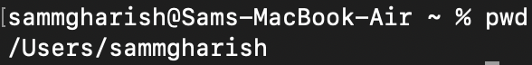
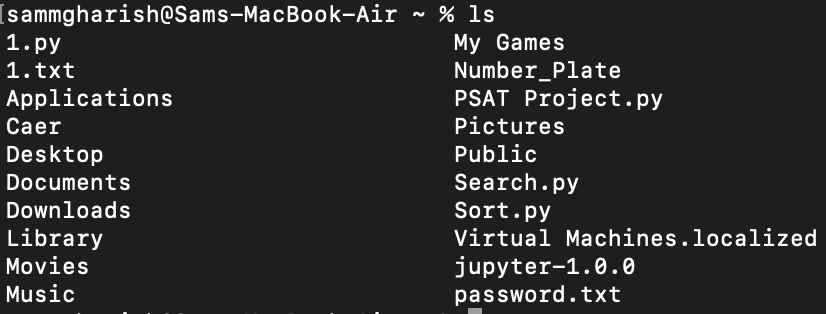
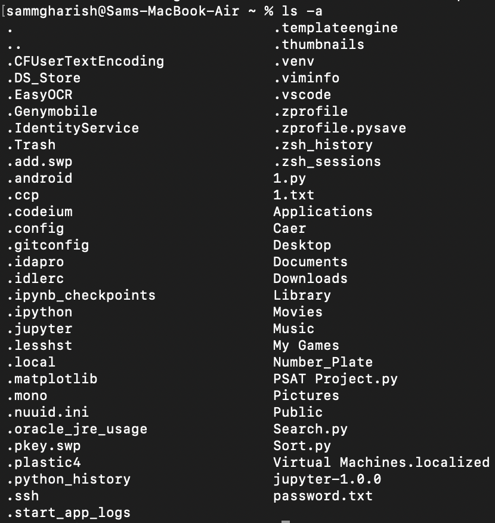
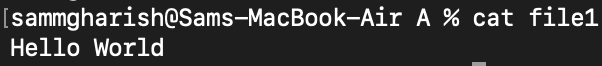
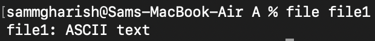
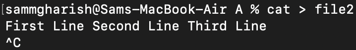
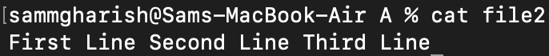
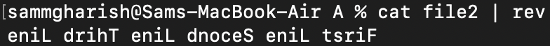
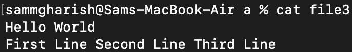
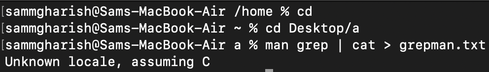

BASH Challenges

1. 
a) To {Display the path of your current directory} Use - 'pwd'

b) To {List out the contents of your current directory} Use - 'ls'

c) To {List out the contents of your current directory including hidden files} Use - 'ls -a'

2. 
a) To Create a new directory named a Use - 'mkdir a'
b) To Move to the newly created directory a Use - 'cd a'
c) To Create a blank file named “file1” Use - 'vi file1' & ':wq'(save and quit)
d) To Display the file type of “file1” Use - 'cat file1'

e) To Add the line “Hello World” to “file1” using the command echo Use - 'echo 'Hello World' > file'(Replace)
                                                                       - 'echo 'Hello World' >> file'(Append)
f) To Display the contents of “file1” Use - 'cat file1'

g) To Display the file type of “file1” again Use - file file1

3. 
a) To Stay in directory a. Create a file “file2” and add the contents below using the  command cat Use - 'cat > file2 \n First Line Second Line Third Line <exit using (control+c)>'

b) To Display the contents of “file2” Use - 'cat file2'

c) To Display the contents of “file2” with the lines reversed Use - 'cat file2 | rev'

4. 
a) To Stay in directory a. Concatenate the contents of “file1” and “file2” and save them into a new file “file3” Use - 'cat file1 file2 > file3'
b) To Display the contents of “file3” Use - 'cat file3'

5. 
a) To Stay in directory a. Create 2 directories b/c with a single command Use - 'mkdir b | mkdir c'
b) To Create a new directory d Use - 'mkdir d'
c) To Copy the directory d to directory c using a single command Use - 'cp -r(recursive{It means that it copies one file at a time and then the another, like a while loop}) d c'
d) To Delete the directory d in the current directory a Use - 'rm -d(directory) d'
e) To Copy “file3” to the directory d with a single command Use - 'cp file3 c/d'

6. 
a) To Go to directory d and rename “file3” to “file0” Use - 'mv file3 file0'
b) To Stay in the same directory and move “file0” to directory a Use - 'mv c/d/file0 c/'

7. 
a) To Go to your home directory Use - 'cd /home'
b) To Create a file named “test” in the directory a/b/c/d Use - 'vi /Users/sammgharish/Desktop/a/c/d/test.txt'
c) To Stay in the home directory. Find and display the path of “test” Use - 'find /Users/sammgharish/Desktop -name test.txt' (Here name is case-sensitive) (Specifing the path is mandatory or put '.' to search in current directory)
                                                                          - Use 'iname' (If you don't want it case sensitive)

8. 
a) To Go to directory a. Get the man page of grep and save its contents to a file named “grepman.txt” Use - 'man grep | cat > grepman.txt'

b) To Print the lines containing the word “FILE” (Case sensitive) in the file “grepman.txt” Use - 'grep 'FILE' grepman.txt'

9. 
a) To Go to directory a and remove the directory b with a single command Use - 'rm -r b'
b) To Remove the files starting with the word “file” with a single command Use - 'rm file*'

10. 
a) To Go to https://blog.bi0s.in/ and download the logo.png image using wget Use - 'wget https://blog.bi0s.in/assets/logo.png'
b) To Do the same with python script (Hint : request library) - Run 10b.py
c) To Also, display the metadata of the png. Use - 

11. 
a.) To Use traceroute on google.com and find list of the IP addresses and hostnames between you and  google.com Use - 

b.) To Find  Subdomains,ip addresses of google.com (Tool i will add if you want me to ) Use - 

12. 
a) To Start a web server on port 8080 with python command Use - 
(In any directory and access the files in web browser )

13. 
a.) Learn about nmap and use that scanner to scan your own machine
b.) To Go to https://tryhackme.com/room/furthernmap and get ip address and Scan the ip address with (-sS,-sV,-A) in your terminal include all ports (Hint : start machine ) Use - 

14. 
a.) To Create a chat application using nc on your local machine with one terminal as server and other as the client Use - 
b.) To Transfer a file from server to client (save that file with another name) and display the file Use - 