BASH Challenges

1. 
a) To {Display the path of your current directory} Use - '___pwd___'  
<!-- By Using 'pwd', you can view in which directory you are in.   -->
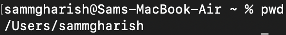  
b) To {List out the contents of your current directory} Use - '___ls___'  
<!-- By using 'ls', you can list the things in the directory.   -->
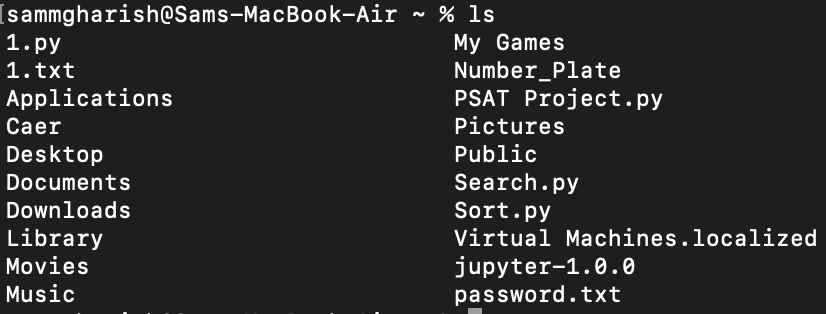  
c) To {List out the contents of your current directory including hidden files} Use - '___ls -a___'  
<!-- By using 'ls -a', you can list even the hidden items in the directory.   -->
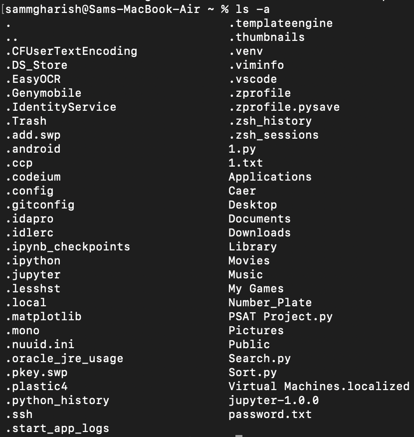  

2. 
a) To Create a new directory named a Use - '___mkdir a___'  
<!-- By using 'mkdir', you can create directories.   -->
b) To Move to the newly created directory a Use - '___cd a___'  
<!-- By using 'cd', you can change directory.   -->
c) To Create a blank file named “file1” Use - '___vi file1___' & '___:wq___'(save and quit)  
<!-- VI is like a text editor, by using 'vi <filename>', you can make work in a text file (or) even write scripts.   -->
d) To Display the file type of “file1” Use - '___cat file1___'  
<!-- By using 'cat', you can view what is there in the file.   -->
  
e) To Add the line “Hello World” to “file1” using the command echo Use  
<!-- - '___echo 'Hello World' > file___'(Replace)  
- '___echo 'Hello World' >> file___'(Append)   -->
<!-- By using 'echo', you can print the content mentioned after it.  
If you mention a file after it with a '>', you will be able to add/ replace content to that file.   -->
f) To Display the contents of “file1” Use - '___cat file1___'  
<!-- By using 'cat', you can view what is there in the file.   -->
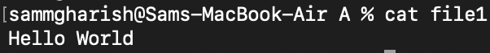  
g) To Display the file type of “file1” again Use - '___file file1___'  
<!-- By using 'file', you can view what kind of file it is.   -->
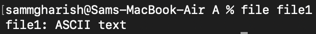

3. 
a) To Stay in directory a. Create a file “file2” and add the contents below using the  command cat Use - '___cat > file2 \n First Line Second Line Third Line <exit using (control+c)>___'  
<!-- By using 'cat', you can even create files also.   -->
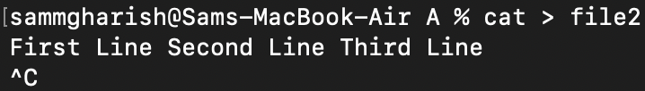  
b) To Display the contents of “file2” Use - '___cat file2___'  
<!-- By using 'cat', you can view what is there in the file.   -->
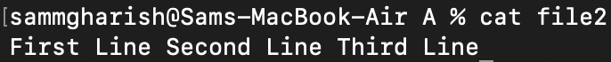  
c) To Display the contents of “file2” with the lines reversed Use - '___cat file2 | rev___'  
<!-- '|' is like an 'and' like it is done after the previous task is completed.   -->
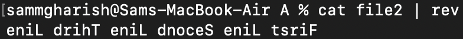  

4. 
a) To Stay in directory a. Concatenate the contents of “file1” and “file2” and save them into a new file “file3” Use - '___cat file1 file2 > file3___'  
<!-- By using 'cat <file1> <file2> > <file3>', you can add contents of both file1 & file2 into file3.   -->
b) To Display the contents of “file3” Use - '___cat file3___'  
<!-- By using 'cat', you can view what is there in the file.   -->
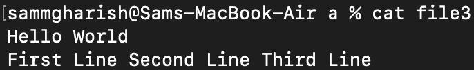

5. 
a) To Stay in directory a. Create 2 directories b/c with a single command Use - '___mkdir b | mkdir c___'  
<!-- By using 'mkdir', you can create directories.   -->
b) To Create a new directory d Use - '___mkdir d___'  
<!-- By using 'mkdir', you can create directories.   -->
c) To Copy the directory d to directory c using a single command Use - '___cp -r d c___'  
<!-- By using 'cp -r', you can copy directory because 'r' means it is in recursion (like a while loop till all files are copied).   -->
d) To Delete the directory d in the current directory a Use - '___rm -d d___'  
<!-- By using 'rm -d', you can even delete directory which has files in it.   -->
e) To Copy “file3” to the directory d with a single command Use - '___cp file3 c/d___'
<!-- By using 'cp', you can copy file from one place to another.   -->

6. 
a) To Go to directory d and rename “file3” to “file0” Use - '___mv file3 file0___'  
<!-- By using 'mv <file1> <file2>', you can rename file.   -->
b) To Stay in the same directory and move “file0” to directory a Use - '___mv c/d/file0 c/___'
<!-- By using 'mv <dir1> <dir2>', you can move file from one directory to another.   -->

7. 
a) To Go to your home directory Use - '___cd /home___'  
<!-- By using 'cd', you can change directory.   -->
b) To Create a file named “test” in the directory a/b/c/d Use - '___vi /Users/sammgharish/Desktop/a/c/d/test.txt___'  
<!-- VI is like a text editor, by using 'vi <filename>', you can make work in a text file (or) even write scripts.   -->

c) To Stay in the home directory. Find and display the path of “test” Use 
- '___find /Users/sammgharish/Desktop -name test.txt___' 
<!-- (Here name is case-sensitive)  
(Specifing the path is mandatory or put '.' to search in current directory)   -->
- Use 'iname' (If you don't want it case sensitive)
<!-- By using 'find', you can find things which you need by specifiing the options.   -->

8. 
a) To Go to directory a. Get the man page of grep and save its contents to a file named “grepman.txt” Use - '___man grep | cat > grepman.txt___'  
<!-- By using 'man', you can get the manual file of a function.
By using 'cat > <file>', you can add data to the file.   -->
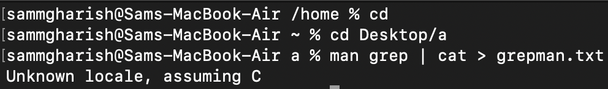  
b) To Print the lines containing the word “FILE” (Case sensitive) in the file “grepman.txt” Use - '___grep 'FILE' grepman.txt___'
<!-- By using 'grep', you can group things based on the options.   -->

9. 
a) To Go to directory a and remove the directory b with a single command Use - '___rm -r b___'  
<!-- By using 'rm -d', you can even delete directory which has files in it.   -->
b) To Remove the files starting with the word “file” with a single command Use - '___rm file*___'
<!-- By using 'rm -d', you can even delete directory which has files in it.   -->

10. 
a) To Go to https://blog.bi0s.in/ and download the logo.png image using wget Use - '___wget https://blog.bi0s.in/assets/logo.png___'  
<!-- By using 'wget <link>', you can get the things in the link to your local device.   -->
b) To Do the same with python script (Hint : request library) - Run 10b.py  
c) To Also, display the metadata of the png.  
<!-- For this you have to have the tool 'exiftool'. 
You can do that by 'sudo apt exif'. 
Using this tool, you can read, write and edit metadata of a Image.   -->
Use - '___exiftool logo.png___'  
<!-- By using 'exiftool <file>', you can view the metadata of the file.   -->
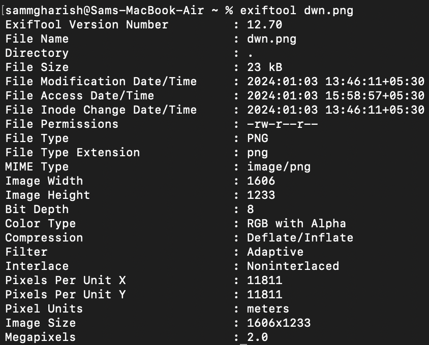

11. 
a) To Use traceroute on google.com and find list of the IP addresses and hostnames between you and google.com Use - '___traceroute google.com___'  
<!-- By using 'traceroute <link>', you can view all the IP's & hostname's between you and link.   -->
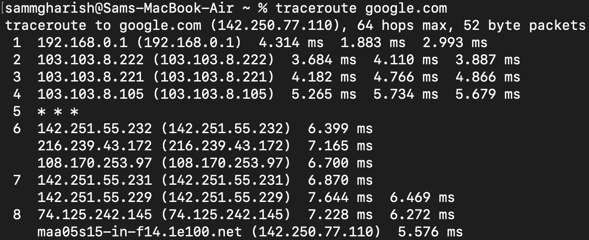  
b) To Find Subdomains, IP addresses of google.com .(Tool i will add if you want me to )
<!-- For this you have to have the tool 'dnsenum'. You can do that by 'sudo apt install dnsenum'. Using this tool, you can see several data.   -->
Use - '___dnsenum --enum google.com___'  
<!-- By using 'dnsenum <option> <link>', you can view various details of the link.   -->
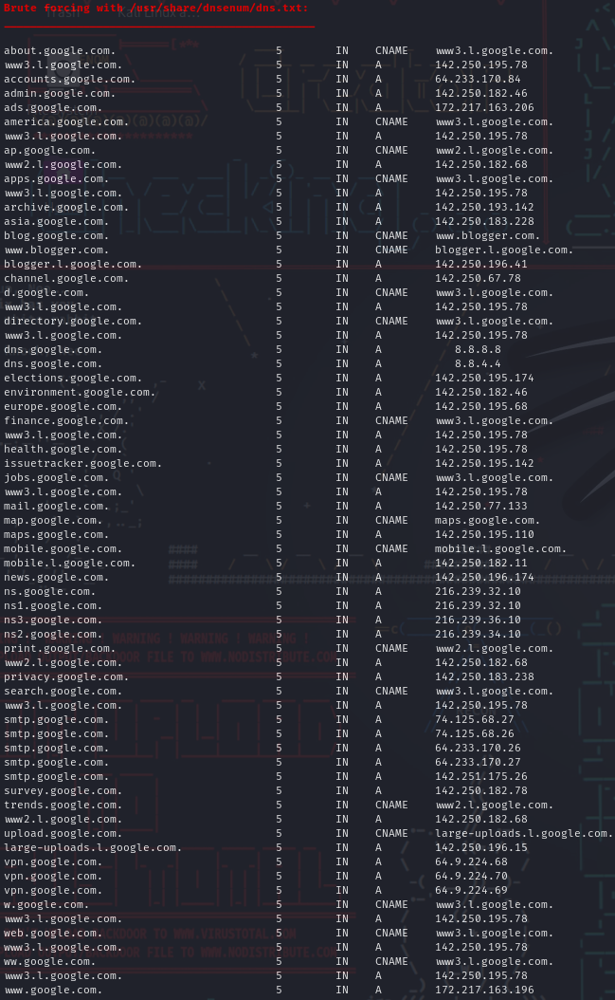  
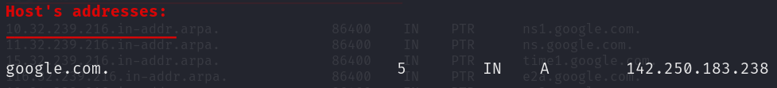  

12. 
a) To Start a web server on port 8080 with python command Use - '___python -m http.server 8080___'  
<!-- By using that, you can make your system available in your local browser.   -->
(In any directory and access the files in web browser ) - '___http://localhost:8080___'  
<!-- By using that, you can view your system in your browser.   -->

13. 
a.) Learn about nmap and use that scanner to scan your own machine - '___nmap localhost___'  
<!-- By using 'nmap <host>', you can scan the host.   -->
b.) To Go to https://tryhackme.com/room/furthernmap and get ip address and Scan the ip address with (-sS,-sV,-A) in your terminal include all ports (Hint : start machine )  
You can scan it by using, '___sudo nmap -sS -sV -A -p- <port>___'  
<!-- By using this, you can scan the IP with several options.   -->

14. 
a.) To Create a chat application using nc on your local machine with one terminal as server and other as the client 
- Server Side Use - '___nc -l -p 34567___'  
<!-- By using this, you can create a conversation and this stays as the server.   -->
- Client Side Use - '___nc localhost 34567___'  
<!-- By using that, you can execute the converstation with the server as a client.   -->
b.) To Transfer a file from server to client (save that file with another name) and display the file  
- Server Side Use - '___cat grepman.txt | nc -l -p 34567___'  
<!-- By using this, you are simply getting the data from the file and send it to the client.   -->
- Client Side Use - '___nc -l -p 34567 > file.txt___'  
<!-- By using that, you are simply making a new file with the data you recieved.   -->