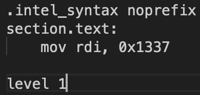
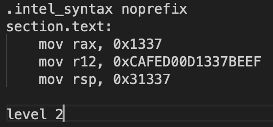
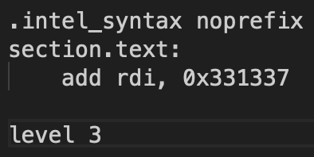
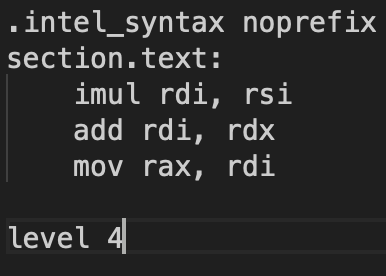
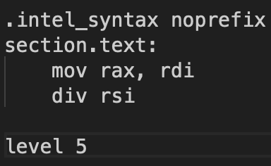
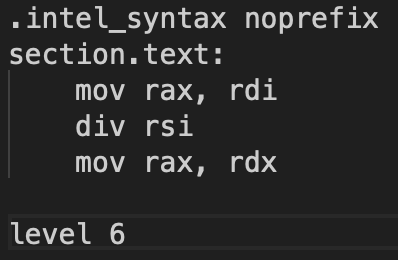
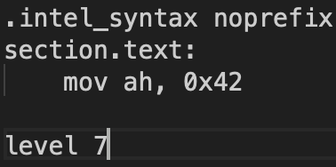
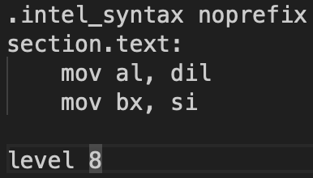
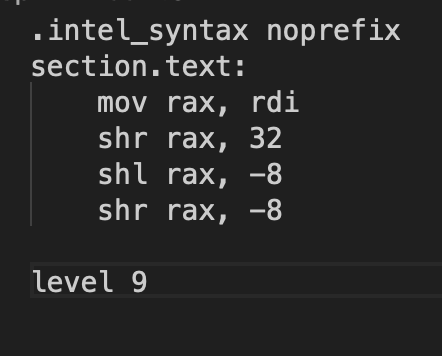
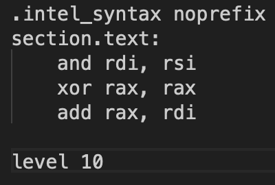

1) 
- For level-1, the task is to set the register.
- Like in terminal how we use mv, rename as well as move the file.
- Here also there is something similar to it, called 'mov'

- It can be done by - 'mov a, b'
- Here 'a' is the destination and 'b' is the value of it.  

2) 
- For level-2, the task is to set multiple registers
- This can be done same as the first one.  

3) 
- For level-3, the task is to add value to preset registers
- It can be done by - 'add a, b'
- Here 'a' is where it should be added and 'b' is the value to be added.  

4) 
- For level-4, the task is to make a function like f(x) = mx + b
- Here all the m, x, b are preset.
- To multiply you can use mul or imul(signed)
- It can be done by - 'mul a, b'
- Here 'a' is where it should be added and 'b' is the value to be added.
- Then to add like before.
- Then to move the final answer to the destination use 'mov'.  

5) 
- For level-5, you are asked to find the speed(distance/ time).
- It can be done by - 'div rsi'
- Before doing that u need to move the dividend, to rax.
- It can be done by - 'mov a, b'
- Here 'a' is the destination and 'b' is the value of it.  

6) 
- For level-6, the task is to find the modulo(reminder)
- Same like before.
- While doing division, the 'rdx' containes the reminder.
- You need to move that back to 'rax'.
- It can be done by - 'mov a, b'
- Here 'a' is the destination and 'b' is the value of it.  

7) 
- For level-7, the task is to change the first two bits of 'ax'(last 4 bits) to something
- For a register, you can segregate it by parts. [Parts_of_Registers](https://en.wikibooks.org/wiki/X86_Assembly/X86_Architecture)
- It can be done by - 'mov a, b'
- Here 'a' is the destination and 'b' is the value of it.  

8) 
- For level-8, the work was to find modulo using 'mov' only
- In case of modulo, x % y, if y is in the form of 2^n, then the modulo is the last bits of x
- You need to mov that to the variable.
- Before that you need to know there is value difference for each register. [Parts_of_Registers](https://en.wikibooks.org/wiki/X86_Assembly/X86_Architecture)
- It can be done by - 'mov a, b'
- Here 'a' is the destination and 'b' is the value of it.  

9) 
- For level-9, the work is to shifting the register values
- Info given
    - shl reg1, reg2       <=>     Shift reg1 left by the amount in reg2; 
    - shr reg1, reg2       <=>     Shift reg1 right by the amount in reg2; 
    - Note: 'reg2' can be replaced by a constant or memory location
- By using this it can be done.  

10) 
- For level-10, the work is to do with logic-gates.
- To Do 'AND' gate, it can be done by - 'and a, b'
- To Do 'OR' gate, it can be done by - 'or a, b'
- To Do 'NOT' gate, it can be done by - 'not a' 
- Here a and b are registers
- But the task is to mve the register value without mov
- The simplest way is to add it to a register with 0 value
- Using xor of same things, the value will be 0
- To Do 'XOR' gate, it can be done by - 'xor a, a'
- Then add it, like before.  
